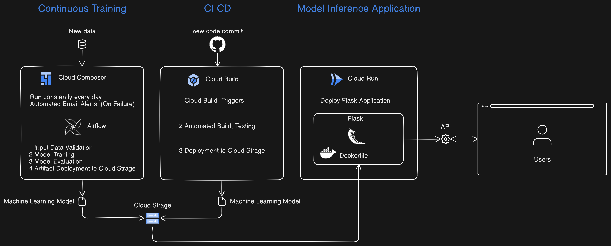

# 広告チャネルごとの費用と収益の関係を予測する機械学習モデルAPI運用のためのMLパイプライン

このプロジェクトは、広告チャネル（検索エンジン、ソーシャルメディア、動画、Eメール）ごとの費用と収益の関係を予測する機械学習モデルの運用パイプラインをGoogle Cloud Platform (GCP)上で構築するためのものです。

- **プロダクト**
- 広告チャネルごとの費用と収益の関係を予測する機械学習推論API運用のためのMLパイプライン
- **開発背景や課題**
- このプロダクトの開発背景は、私が大学の研究活動やエンジニアインターンでの経験から、MLOpsに強い興味を持ったことにあります。これまで関わったプロジェクトでは、機械学習モデルの開発までは行ったものの、実際に運用まで至った経験は少なかったため、自身でその領域を学び、基礎を習得しようと考えました。
具体的なケーススタディとして、ある企業のマーケティング部門のMLOps活用を取り上げました。具体的には、広告チャネルの多様化により、どのチャネルにどれだけの予算を配分すべきかがますます難しくなっているという課題を解決するために、過去のデータを基に広告費用と収益の最適な関係を予測する機械学習モデルを開発し、これを自動化されたパイプラインで運用することを目指しました。
- **技術的にこだわった点や工夫した点**
- 技術的にこだわった点は、Google Cloud Platformで提供される専用のMLOpsツールであるVertex AI に依存しないようにしつつ、Googleが提唱するMLOpsレベル2を目指して機械学習パイプラインを実装したことです。具体的には、Airflowを利用して機械学習モデルの継続的トレーニングを定時刻に自動実行させるように設計し、またGitHubへのpushをトリガーとして、自動化CI/CDのパイプラインを構築しました。このCI/CDパイプラインは、機械学習モデルが更新されるたびにCloud Runでホストされる推論APIが自動的に最新のモデルを反映するように設計されています。
さらに、工夫した点としては、Cloud Loggingを活用したログ一括管理、BigQueryを用いたモデルの評価指標の保存、Cloud Monitoringによる継続的トレーニング失敗時のアラート通知など、運用面での管理性を意識した設計にしながら、Vertex AIに依存しないようにしたことです。
将来的には、特徴量エンジニアリング、ハイパーパラメータチューニングへの対応、Terraformを用いたインフラのコード化、セキュリティとデータ保護の強化など、さらにプロジェクトを発展させる予定です。

## ワークフロー概要

### 1. データ収集

- 広告チャネルごとの費用データと月次収益データを収集し、Google Cloud Storage (GCS) に保存します。

### 2. モデルの定期的な再トレーニングと最新モデルのデリバリー (GCP Composer - Airflow)

- **毎日のスケジュール実行**: Airflowを使用して、以下のタスクを毎日定時に自動実行します。
  - **データ検証**: 入力データの整合性を確認し、問題があればアラートを生成します。
  - **モデルのトレーニング**: multiple linear regressionを用いて、広告費用と収益の関係を学習します。
  - **モデルの評価**: トレーニングされたモデルの性能を評価し、精度やR2スコアを計算します。
  - **成果物のGCSへのデプロイ**: トレーニング済みモデルを`.joblib`ファイルとしてGCSにデプロイします。
- **自動メールアラート**: タスクが失敗した場合、自動的にメールでアラートを送信します。

### 3. CI/CDプロセスの設定 (GCP Cloud Build)

- **ユニットテストの実行**: PyTestを使用して、モデルのトレーニングスクリプトのユニットテストを実行します。
- **ソースコードのバージョン管理**: GitHubリポジトリを作成し、ソースコードのバージョン管理を行います。
- **ビルド、テスト、デプロイの自動化**: Cloud Buildを使用して、コードのビルド、テスト、およびデプロイを自動化します。
- **Cloud Build トリガー**: GitHubリポジトリに新しい変更がコミットされるたびに、自動でビルド、テスト、デプロイが実行されます。

### 4. モデル推論APIのデプロイ (GCP Cloud Run)

- **Flaskアプリケーションのデプロイ**: Flaskで開発したモデル推論APIをGoogle Cloud Runにデプロイします。これにより、スケーラブルで高可用性のアプリケーションとして提供します。
  - APIは広告チャネルごとの月次の費用データをJSON形式で受け取り、予測されたROIを返します。

## 使用技術

- **Google Cloud Platform (GCP)**
  - Google Cloud Storage (GCS)
  - Cloud Composer (Airflow)
  - Cloud Build
  - Cloud Run
- **Python**
  - Flask
  - scikit-learn
  - PyTest

